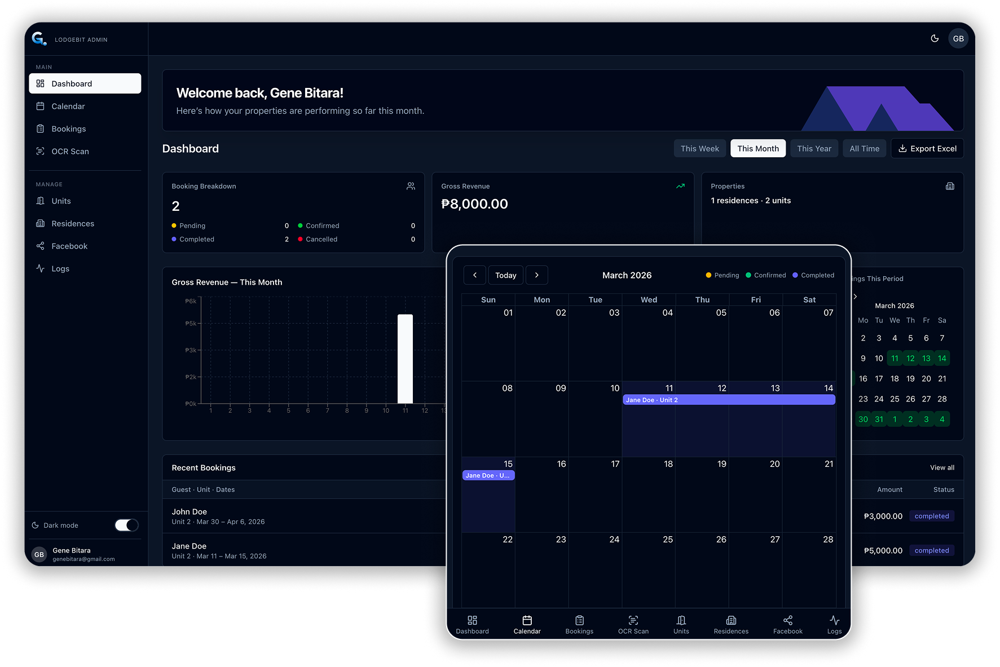
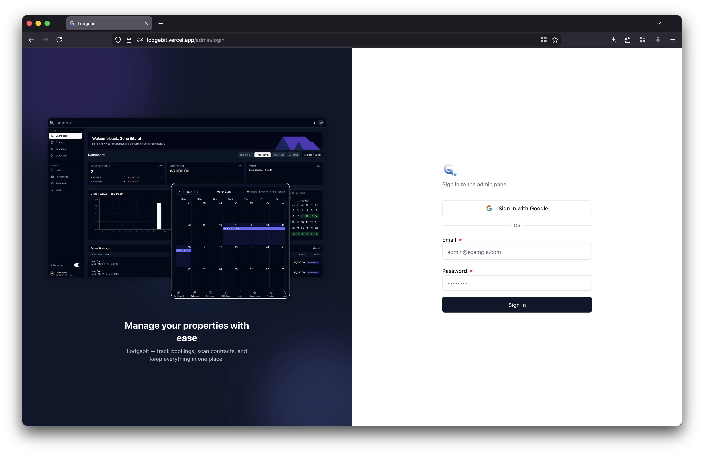
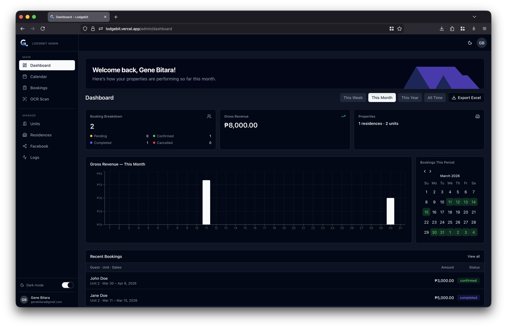
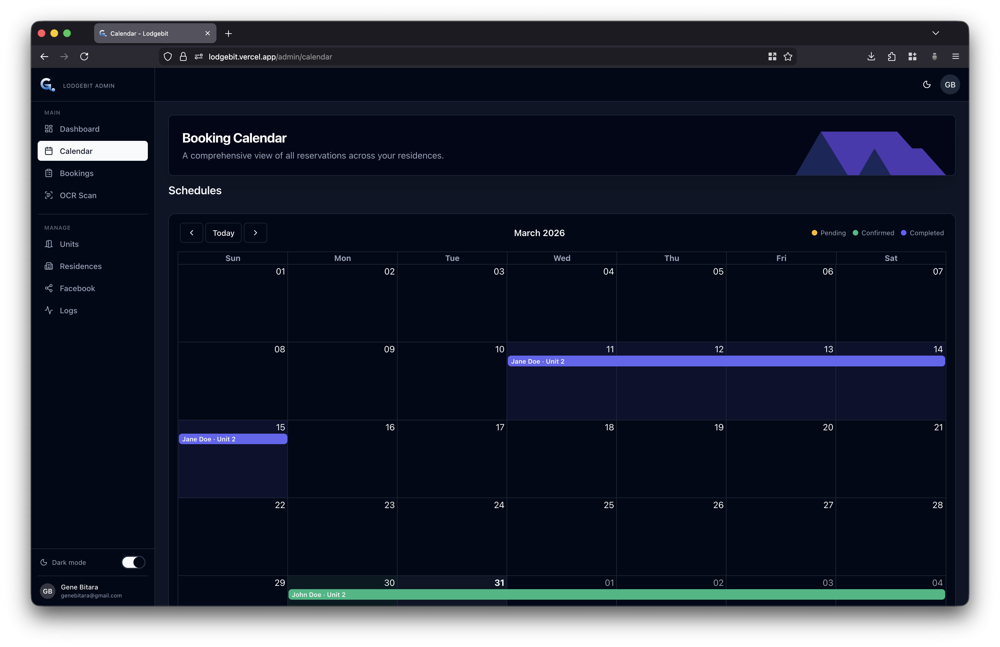
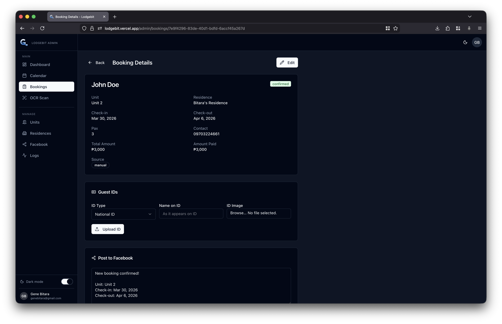
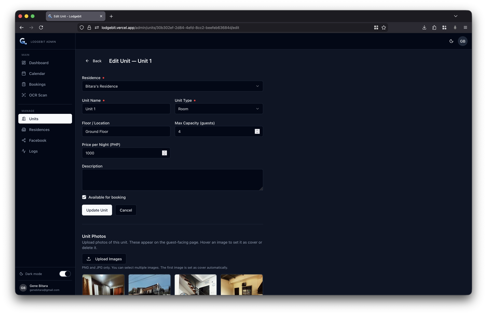
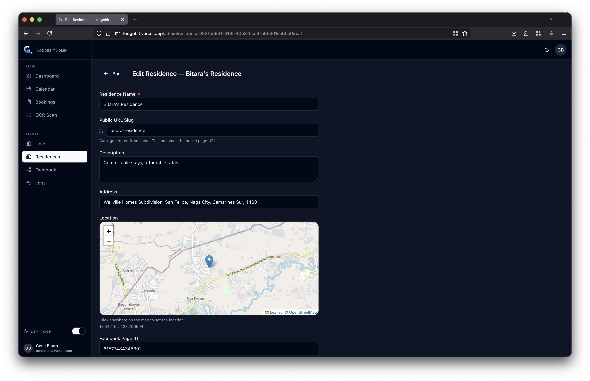
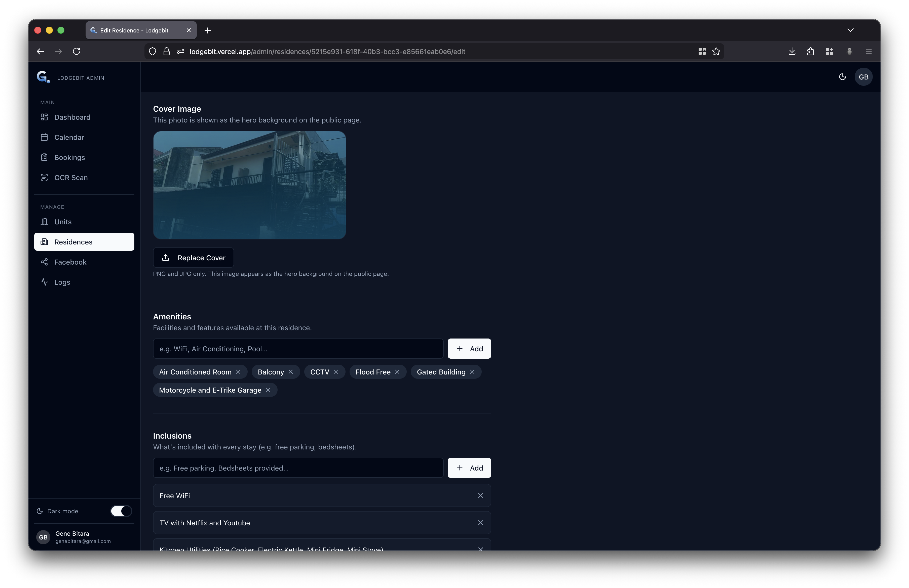
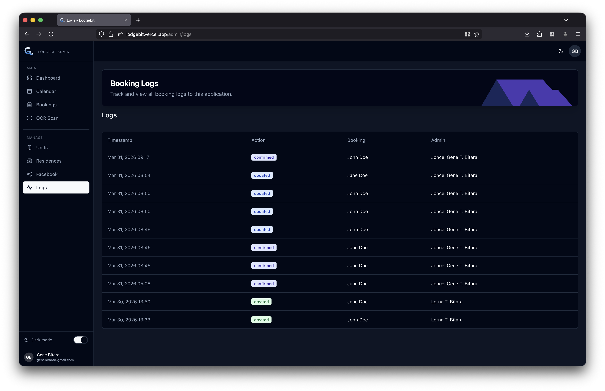
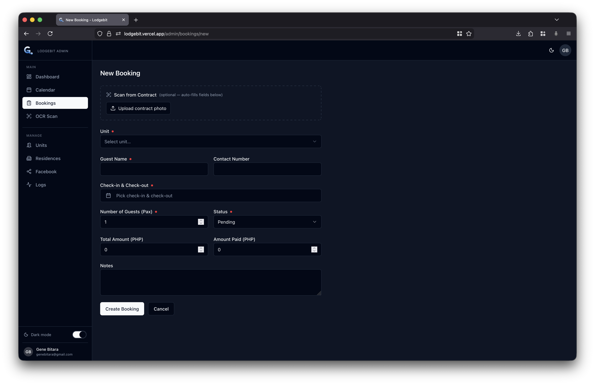

# Lodgebit

**Lodgebit** is a multi-residence transient booking management platform built with Next.js 16. Each residence gets its own public-facing website while sharing a single admin panel.

<p align="center">
  
</p>

<details>
<summary><strong>System Snapshots</strong></summary>
<br>











</details>

---

## Features

- **Multi-residence support** — manage multiple properties from one admin panel
- **Dynamic public pages** — each residence gets a templated page at `/r/[slug]`
- **Booking calendar** — month view with real-time availability for guests and admins
- **Unit gallery** — bento-grid image gallery with lightbox per unit
- **OCR contract scanning** — extract booking details from contract photos via Google Cloud Vision
- **Facebook auto-posting** — post booking updates to a Facebook Page via Meta Graph API
- **Dark mode** — system-aware, toggle in admin topbar
- **PWA** — installable on mobile via `next-pwa`
- **Google Sign-in** — OAuth login for admins (only pre-registered emails allowed)

---

## Tech Stack

<p align="left">
  <a href="https://go-skill-icons.vercel.app/">
    
  </a>
</p>

| Layer | Technology |
|-------|-----------|
| Framework | Next.js 16.2 (App Router, Server Components) |
| Auth | NextAuth v5 (Credentials + Google OAuth) |
| Database | Supabase (PostgreSQL) |
| Storage | Supabase Storage (S3-compatible) |
| UI | shadcn/ui + Tailwind CSS v4 |
| Map | Leaflet (OpenStreetMap, no API key needed) |
| PWA | next-pwa |
| OCR | Google Cloud Vision API |
| Social | Meta Graph API |

---

## Local Setup

### 1. Clone and install

```bash
git clone <repo-url>
cd lodgebit
npm install
```

### 2. Environment variables

Copy `.env.example` to `.env.local` and fill in the values:

```bash
cp .env.example .env.local
```

| Variable | Description |
|----------|-------------|
| `NEXT_PUBLIC_SUPABASE_URL` | Your Supabase project URL |
| `NEXT_PUBLIC_SUPABASE_ANON_KEY` | Supabase anon/public key |
| `SUPABASE_SERVICE_ROLE_KEY` | Supabase service role key (server-only) |
| `AUTH_SECRET` | Random secret for NextAuth JWT — generate with `openssl rand -base64 32` |
| `AUTH_URL` | Full base URL (e.g. `http://localhost:3000`) |
| `GOOGLE_CLIENT_ID` | Google OAuth client ID |
| `GOOGLE_CLIENT_SECRET` | Google OAuth client secret |
| `GOOGLE_CLOUD_VISION_API_KEY` | Google Cloud Vision API key (for OCR) |
| `META_APP_ID` | Meta (Facebook) App ID |
| `META_APP_SECRET` | Meta App Secret |
| `META_PAGE_ACCESS_TOKEN` | Long-lived Facebook Page access token |

### 3. Supabase setup

**Run the database migration** in the Supabase SQL editor (`database/migration.sql`).

**Create the following Storage buckets** in Supabase → Storage:

| Bucket | Access | Purpose |
|--------|--------|---------|
| `unit-images` | Public | Unit gallery photos |
| `residence-covers` | Public | Hero cover images for public pages |
| `guest-ids` | Private | Guest ID photo uploads |
| `contracts` | Private | Contract scan uploads |

### 4. Create the first admin

Lodgebit uses **bcrypt** to hash passwords. You must never insert plain-text passwords into the database.

#### Option A — Supabase SQL editor (uses pgcrypto)

The `pgcrypto` extension is enabled by default on Supabase. Run this directly in the SQL editor:

```sql
INSERT INTO admins (full_name, email, password_hash, role)
VALUES (
  'Your Name',
  'you@example.com',
  crypt('yourpassword', gen_salt('bf')),
  'super_admin'
);
```

`gen_salt('bf')` generates a bcrypt salt (blowfish). `crypt()` hashes the password against it. This is compatible with the `bcryptjs` verification used by the app.

#### Option B — Generate hash locally with Node.js

If you prefer to generate the hash outside of Supabase:

```bash
node -e "const b = require('bcryptjs'); b.hash('yourpassword', 10).then(h => console.log(h));"
```

Then insert the printed hash directly:

```sql
INSERT INTO admins (full_name, email, password_hash, role)
VALUES (
  'Your Name',
  'you@example.com',
  '$2a$10$...',   -- paste the hash from the command above
  'super_admin'
);
```

#### Adding more admins

Use the same SQL `INSERT` for each additional admin. To give Google Sign-in access, insert the admin row with any placeholder `password_hash` — the password is never used when signing in via Google:

```sql
INSERT INTO admins (full_name, email, password_hash, role)
VALUES (
  'Another Admin',
  'colleague@example.com',
  crypt(gen_random_uuid()::text, gen_salt('bf')),  -- random unusable password
  'admin'
);
```

> **Roles:** `super_admin` has full access. `admin` is a standard admin (role enforcement is handled at the app level).

### 5. Facebook Page Integration

Facebook posting requires a **Page Access Token** and the correct **Page ID** stored in Supabase per residence. Follow these steps exactly — order matters.

#### Step 1 — Create a Meta App

1. Go to [Meta for Developers](https://developers.facebook.com) → **My Apps → Create App**
2. Choose **Business** type, name it (e.g. `Lodgebit`)
3. Note the **App ID** and **App Secret** from Settings → Basic

#### Step 2 — Generate a Page Access Token (never expires)

Page Access Tokens generated from a **long-lived user token** do not expire. Page tokens generated from a short-lived token expire in 1 hour.

1. Go to **Tools → Graph API Explorer**
2. Select your app (e.g. `Lodgebit`) under **Meta App**
3. Under **User or Page**, keep **your user account** selected
4. Under **Permissions**, add: `pages_show_list`, `pages_read_engagement`, `pages_manage_posts`
5. Click **Generate Access Token** → approve the OAuth dialog
6. Click the **ⓘ info icon** next to the token → **Open in Access Token Debugger** → **Extend Access Token** → copy the 60-day user token
7. Go back to Graph API Explorer → **manually paste** the 60-day token into the Access Token field
8. Open the **User or Page** dropdown → under **Page Access Tokens** → click your Page name
9. Copy the token now shown in the Access Token field
10. Paste it into the **Access Token Debugger** — confirm Type = **Page** and Expires = **Never** (or ~60 days if app is in Development mode)

> **Note:** The "Never" expiry only applies to apps in **Live mode** (requires Meta app review). In Development mode, tokens expire after ~60 days. Set a reminder to refresh before expiry.

#### Step 3 — Get the correct Page ID

In the Access Token Debugger, copy the **Page ID** shown next to your page name (e.g. `1099355329923830`). Do **not** use a personal profile ID.

#### Step 4 — Update The Page ID

Navigate throught the application under residences page and update the Facebook Page ID

---

### 6. Google OAuth (Sign-in with Google)

1. Create a project at [Google Cloud Console](https://console.cloud.google.com)
2. Enable the **Google+ API** or **People API**
3. Create OAuth 2.0 credentials (Web application)
4. Add authorized redirect URI: `http://localhost:3000/api/auth/callback/google`
5. Copy Client ID and Client Secret to `.env.local`

> Only users whose email already exists in the `admins` table can sign in with Google.

### 7. Run the development server

```bash
npm run dev
```

Open [http://localhost:3000](http://localhost:3000) to see the Lodgebit index.
Admin panel: [http://localhost:3000/admin](http://localhost:3000/admin)

---

## URL Structure

| URL | Description |
|-----|-------------|
| `/` | Lodgebit index — lists all residences |
| `/r/[slug]` | Public page for a specific residence |
| `/admin` | Redirects to `/admin/calendar` |
| `/admin/login` | Admin sign-in (credentials or Google) |
| `/admin/calendar` | Booking calendar view |
| `/admin/bookings` | All bookings list |
| `/admin/residences` | Manage residences |
| `/admin/units` | Manage units per residence |
| `/admin/ocr` | Scan and parse booking contracts |
| `/admin/facebook` | Facebook post history |
| `/admin/logs` | Booking change audit log |

---

## Deployment (Vercel)

1. Push the repo to GitHub
2. Import into [Vercel](https://vercel.com)
3. Add all environment variables from `.env.example` in the Vercel project settings
4. Update `AUTH_URL` to your production domain (e.g. `https://yourdomain.com`)
5. Add your production domain to Google OAuth authorized redirect URIs

> The build command is `next build --webpack` (required for `next-pwa` compatibility with Turbopack).
